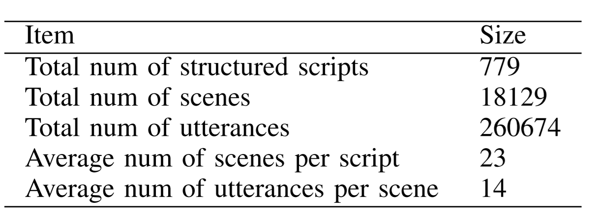
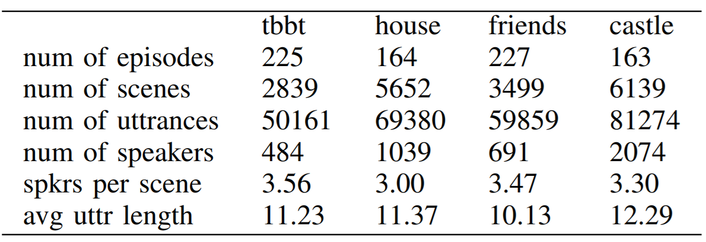
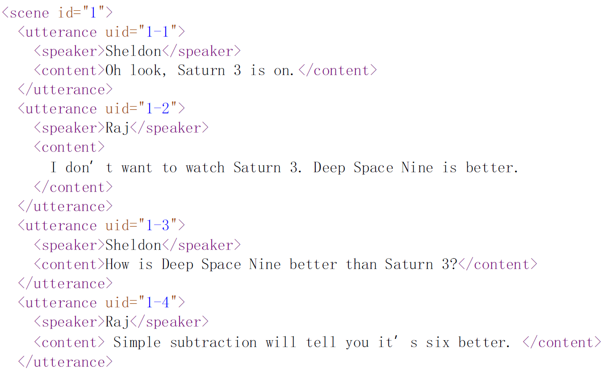
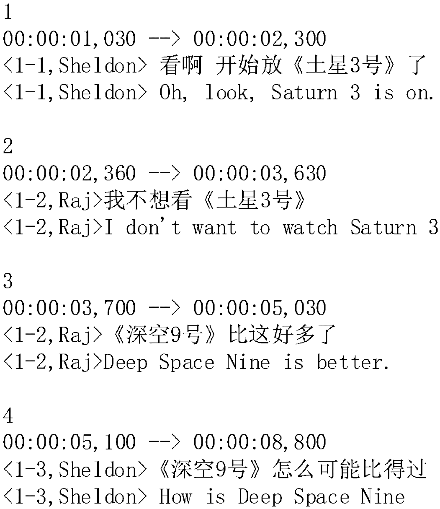
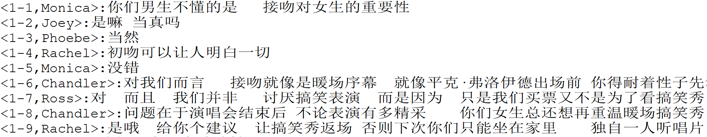

# TV4Dialog  Corpus

By Leilan Zhang

TV4Dialog is a multi-turn **Chinese** and **English** dialogue corpus, which is constructed based on scripts and subtitles of 4 TV series: *Castle*, *Friends*, *House*, *TBBT*.  This corpus is suited to the fields of dialogue generation, dialogue analysis and machine translation.

### License


TV4Dialog is a part of contribution of our paper *Automatically Annotate TV Series Subtitles for Dialogue Corpus Construction*. 

The data in this repository is provided under the license [CC BY 2.0](<https://creativecommons.org/licenses/by/2.0/>). Please cite the following paper if you use the data: 

> ```
> @inproceedings{zhang2019,
>   title={Automatically Annotate TV Series Subtitles for Dialogue Corpus Construction},
>   author={Leilan Zhang, Qiang Zhou},
>   year={2019},
>   publisher = {{APSIPA} Press},
>   address={Lanzhou, Gansu, China}
> }
> ```

### How TV4Dialog was made

We first collected the English scripts and Chinese-English subtitles of the 4 TV series from the Internet. The scripts were then parsed to XML format with extracted elements like scenes, speakers and utterances. 

Using the methods proposed in our paper, we aligned the utterances in scripts to the subtitle lines and annotated the subtitles with speaker tags. According to those annotated tags, we merged the continuous subtitle lines belong to the same speaker to a single utterance.

### Details of TV4Dialog

This corpus is composed of 26w utterances both in Chinese and English. It provides both the scripts (en) and the subtitle (en & zh),  basic statistics are list below:

<div align=center></div>

<div align=center></div>


Directory **xmlScript** stores the parsed scripts of the 4 TV series in XML format (in English). 

<div align=center></div>

Directory **withSpkr** stores the subtitles annotated with speaker tags and *uid* tags (en & zh parallel).

<div align=center></div>

Directory **extracted** stores the merged utterances extracted from the annotated subtitles (in Chinese).

<div align=center></div>

### Acknowledgments

We would like to thank website [assrt.net](http://assrt.net) for the help of providing the raw subtitle files.